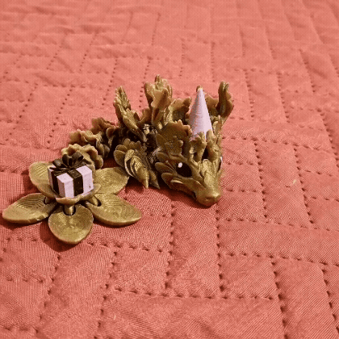

# 🐉 Scheda Personaggio: Leo

  <!-- Colonna di Sinistra: GIF -->
  

    
  

  <!-- Colonna di Destra: Scheda ed Info -->
  

## 📋 Informazioni Generali

| Parametro | Dettaglio |
| :--- | :--- |
| **Nome** | **Leo** |
| **Sesso** | Maschio ♂️ |
| **Tipo** | Cuore dark |
| **Colore** | Blu e Verde |
| **Cibo Preferito** | 🫘 Fagioli |

## 🎨 Aspetto Fisico e Particolarità

* **Bicolorazione:** Un lato del corpo è verde, l'altro è blu.
* **Segni Particolari:** Corno destro spezzato 🦄
* **Sguardo:** Occhi grandi ed espressivi.
* **Attitudine:** Indole naturale da capo e leader.

## 🧠 Psicologia ed Emozioni

### 💔 Paure
* Perdere la propria famiglia
* Essere abbandonato

> **Reazione alla paura:** Quando prova spavento o vulnerabilità, abbassa lentamente il capo.

### 🌟 Felicità
* Vedere gli altri felici e al sicuro.

  

---
*Scheda gestita con ❤️ tramite GitHub Pages e Cayman Theme.*
